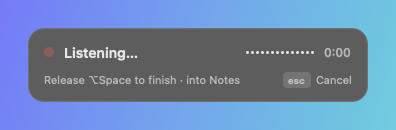
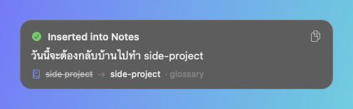
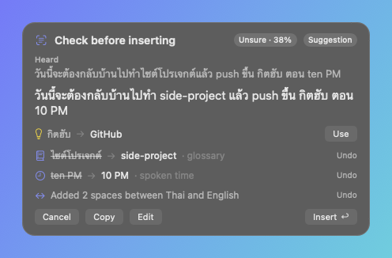

# Krasip

Hold **⌥ Space**, speak Thai and English the way you normally do, let go — and clean Thai-English text appears where your cursor is.

```text
You say:    วันนี้จะต้องกลับบ้านไปทำ side project
You get:    วันนี้จะต้องกลับบ้านไปทำ side-project
```

Krasip keeps English words in English, uses your own spellings from a personal glossary, and never sends your text to an AI to "improve" it. The whole interface is in Thai and English — pick either in Settings → Languages, whatever language macOS is in. Built from [`docs/KRASIP_MVP_SPEC.md`](docs/KRASIP_MVP_SPEC.md) (macOS 14+).

| Listening | Result | Check before inserting |
| --- | --- | --- |
|  |  |  |

In Thai: [languages](docs/screenshots/settings-languages-th.png) · [glossary](docs/screenshots/settings-glossary-th.png) · [review](docs/screenshots/overlay-review-th.png)

More screens: [glossary](docs/screenshots/settings-glossary.png) · [languages](docs/screenshots/settings-languages.png) · [general](docs/screenshots/settings-general.png) · [privacy](docs/screenshots/settings-privacy.png) · [history list](docs/screenshots/history-list.png) · [history detail](docs/screenshots/history-detail.png) · [learning offer](docs/screenshots/overlay-learning-offer.png) · [clipboard fallback](docs/screenshots/overlay-copied.png) · [setup](docs/screenshots/setup-welcome.png) · [benchmark](docs/screenshots/benchmark.png)

---

**New here?** [`docs/HANDOFF.md`](docs/HANDOFF.md) is the five-minute version: what works, what was checked, and what still needs your hands.

## Quick start

1. Open `Krasip.xcodeproj` in Xcode.
2. Choose the **Krasip** scheme and **My Mac**, then press **⌘R**.
3. The setup guide opens. Allow the **Microphone** and **Accessibility**, and pick a speech engine.
4. Click into any text field (Notes is a good first try), hold **⌥ Space**, speak, and let go.

Krasip lives in the **menu bar** (a waveform icon). There is no Dock icon unless a Krasip window is open.

> Signing uses your team `45C3927649` with automatic signing. Keep signing with the same certificate, or macOS will ask for the Accessibility permission again after each build.

### Everyday use

| Action | How |
| --- | --- |
| Dictate | Hold ⌥ Space, speak, let go |
| Hands-free (long dictation) | Quick-tap ⌥ Space, speak, tap ⌥ Space again |
| Cancel | Esc while listening or transcribing |
| Check the text first | Settings → General → "Let me check it first" (or per app) |
| Fix a past dictation | Menu bar → History… |
| Teach a spelling | Settings → Glossary, or select a word in History → "Add Preferred Spelling…" |
| Compare speech engines | Menu bar → Benchmark… (record the 50 sentences, add your own) |
| Pick a microphone | Settings → General → Microphone |
| Switch the app to Thai | Settings → Languages → Show Krasip in → ไทย, then Restart Now |

---

## Speech engines

All three sit behind one small interface (`Transcriber`), so each can be swapped without touching anything else.

| Engine | Where audio goes | Setup | Notes |
| --- | --- | --- | --- |
| **Apple — on this Mac** (default on macOS 26+) | Stays on the Mac | Download the Thai model once (Settings → Languages) | Excellent for plain Thai. English words spoken with a Thai accent can come back Thai-spelled; the glossary fixes the ones you care about. |
| **Apple — online** (default on macOS 14/15) | Apple | Allow Speech Recognition | Same trade-offs, needs internet. |
| **OpenAI — cloud** | Your chosen endpoint | Paste an API key | Best at mixed Thai-English. Works with any OpenAI-compatible `/audio/transcriptions` endpoint (OpenAI, Groq, …), including a **local Whisper server** at `http://localhost…` (no key needed, audio stays on the Mac). |

The OpenAI adapter sends only the audio plus spelling hints from your glossary. The transcript itself is never sent anywhere.

Run the **Benchmark** window with your own voice to pick the engine that works best for you (the spec's "select an ASR adapter after Thai-English benchmark testing").

---

## How it works

```text
Hotkey → Dictation → Transcription → Text policy (+ Glossary) → Insertion → History
```

| Module (spec) | Code | Interface |
| --- | --- | --- |
| Dictation | `KrasipSystem/Audio/MicrophoneRecorder` | `start()`, `stop()`, `cancel()`, `states: AsyncStream<DictationState>` |
| Transcription | `KrasipCore/Transcription/Transcriber` + adapters in `KrasipSystem/Transcription` | `transcribe(audio, languages:) -> Transcript` (raw text, language spans, confidence) |
| Text policy | `KrasipCore/TextPolicy/TextPolicy` | `finalize(rawText, glossary:, style:) -> FinalText` (text + every change + suggestions) |
| Glossary | `KrasipCore/Glossary/Glossary` | `resolve(text) -> [Replacement]`, `learn(raw:corrected:) -> Suggestion?` |
| Insertion | `KrasipSystem/Insertion/TextInserter` | `insert(text, into:) -> InsertionResult` |
| History | `KrasipStorage/HistoryStore` (SQLite) | `record(raw:final:destinationApp:)`, `recent()`, `applyCorrection(id:finalText:)` |

`DictationFlow` (in `KrasipCore/Pipeline`) runs one dictation end to end. It only talks to the modules through closures, so every path — low confidence, insertion failure, password field, cancel — is unit-tested with fakes.

### Text policy rules (in order)

1. Normalize Unicode and whitespace.
2. Protect URLs, emails, and code so nothing below can touch them.
3. Apply **locked** glossary aliases (exact, normalized match only). Collect **suggest** matches, and Thai spellings that only *sound like* an alias (suggested, never applied without you).
4. Spoken clock times → digits: `ten AM` → `10 AM`.
5. Protect the remaining English words and numbers exactly as heard.
6. One space where Thai touches English or digits: `ทำside-project` → `ทำ side-project`.
7. Your punctuation choice (keep / drop final period / remove).
8. Tidy spaces.

Every change is returned in the spec's format, e.g. `side project -> side-project (glossary)`, shown in the overlay and History, and can be undone.

### Insertion

1. No Accessibility permission → copy, show **"Copied — paste with Command+V"**.
2. Password field → never typed (Krasip also refuses to listen there).
3. Native text field → set through Accessibility, then checked that it landed.
4. Web pages, Electron apps (Slack, VS Code), or a field that ignored step 3 → paste with ⌘V and put your clipboard back.
5. If the app visibly rejects the paste → keep the text on the clipboard and say so.

The text is always kept: in the overlay, on the clipboard when needed, and in History (unless you turned history off).

---

## Project layout

```text
Krasip.xcodeproj           Xcode project (synchronized folders — add files on disk)
Krasip.xctestplan          ⌘U runs all three package test targets
Config/                      Base.xcconfig, entitlements, extra Info.plist keys
Krasip/                    The app: SwiftUI + AppKit glue
  App/                       Entry point, AppDelegate, AppController (composition root)
  Core/                      Settings, observable models, services, design system, AppString
  Features/                  Overlay, MenuBar, Settings (4 tabs), History, Onboarding, Benchmark
  Resources/                 Assets (app icon, accent color), Localizable.xcstrings (English + Thai)
Packages/KrasipKit/        Swift package with the pipeline modules and all tests
  Sources/KrasipCore       Pure logic: text policy, glossary, learning, flow, benchmark metrics
  Sources/KrasipStorage    SQLite: history, corrections, glossary, per-app rules
  Sources/KrasipSystem     macOS adapters: microphone, speech engines, insertion, hotkey, Keychain
scripts/build-release.sh     Builds ./build/Krasip.app you can double-click
docs/                        Spec, spec checklist, manual test plan, design notes, screenshots
```

All user-facing text lives in `Krasip/Core/Utilities/AppString.swift` and is translated in `Krasip/Resources/Localizable.xcstrings`. The package's three error types have their own small catalogs next to their sources.

---

## Tests

```bash
cd Packages/KrasipKit
swift test                      # 160 tests, about one second
KRASIP_LIVE_ASR=1 swift test  # also runs Apple's on-device Thai recognizer on generated speech (macOS 26)
```

Or press **⌘U** in Xcode (the scheme runs all three test targets). Tests use Swift Testing. Every test is explained in plain English in [`TESTS_EXPLAINED.md`](TESTS_EXPLAINED.md).

The spec's acceptance table is `Tests/KrasipCoreTests/AcceptanceTests.swift`.

### Developer tools (Debug builds)

```bash
# Render every screen to PNGs, using throwaway sample data
<Krasip.app>/Contents/MacOS/Krasip --render-previews /tmp/krasip-previews

# Run real dictations with a fake microphone and a fixed transcript:
# drives the overlay, history, and hotkey bindings, then writes simulation.log + PNGs
<Krasip.app>/Contents/MacOS/Krasip --simulate-dictation /tmp/krasip-sim
```

The simulation is how the overlay was checked without a microphone: it confirms the panel size
and position per phase, the auto-dismiss timing, hands-free tapping, Esc, and that history and
the glossary see the right text.

---

## Data and privacy

- Everything is stored in `~/Library/Application Support/Krasip/` (`Krasip.sqlite`).
- Text history is on by default and can be turned off, limited (1–90 days), or deleted.
- Audio is saved **only** if you turn on **Keep audio for retry** (Settings → Privacy).
- API keys are stored in the macOS Keychain.
- If you used the earlier prototype, its `glossary.json` is imported once on first launch — from this folder or from `~/Library/Application Support/WispFlow/`, the folder used before the app was renamed.
- Dictation history does not move across that rename. To keep the old history, quit every copy of the old build and copy its database across:
  ```bash
  cp ~/Library/Application\ Support/WispFlow/WispFlow.sqlite \
     ~/Library/Application\ Support/Krasip/Krasip.sqlite
  ```

---

## Troubleshooting

| Problem | Fix |
| --- | --- |
| No menu bar icon | The menu bar may be full or hidden behind the notch. Quit a few menu bar apps, or check System Settings → Menu Bar. |
| "Shortcut problem" in the menu | Another app uses ⌥ Space (ChatGPT does by default). Pick another shortcut in Settings → General. |
| Text is copied instead of typed | Allow Krasip in System Settings → Privacy & Security → Accessibility. After a rebuild with a different certificate, remove and re-add it there. |
| One app always says "Copied" | That app hides its text field from Accessibility. Settings → General → How to insert text → **Always paste**. |
| English words come out in Thai letters | Add a glossary entry (or use Starter Terms), turn on sound-alike suggestions, or try the OpenAI engine. |
| "Didn't catch that" | Hold the shortcut a moment longer and speak after the red dot appears. |

See [`docs/HANDOFF.md`](docs/HANDOFF.md) for the state of the project, [`docs/MANUAL_TEST_PLAN.md`](docs/MANUAL_TEST_PLAN.md) for a 15-minute hands-on checklist, [`docs/SPEC_CHECKLIST.md`](docs/SPEC_CHECKLIST.md) for how each spec requirement is covered, and [`docs/DESIGN_NOTES.md`](docs/DESIGN_NOTES.md) for why the code is shaped this way.
# Krasip
